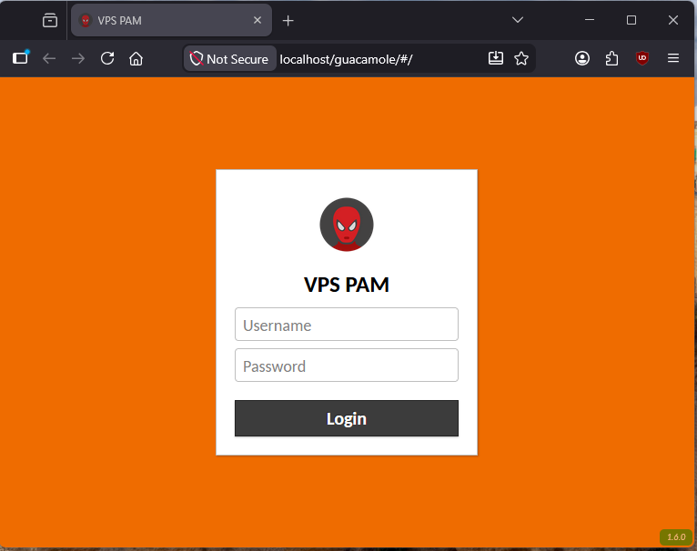
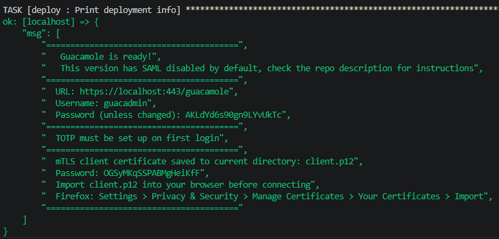
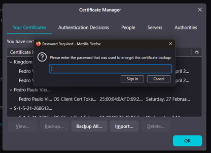
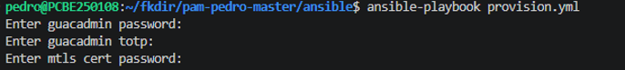
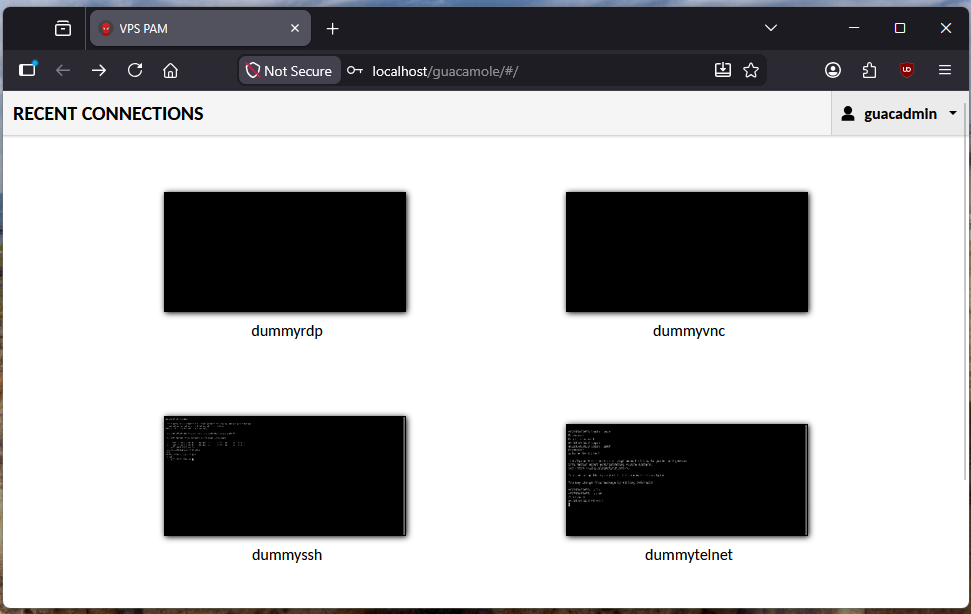
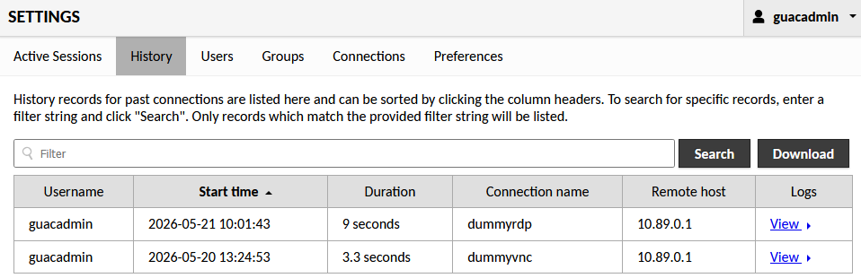
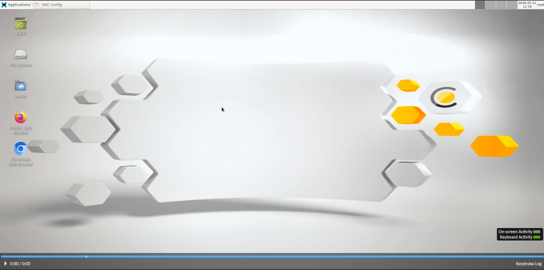
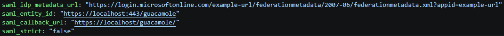
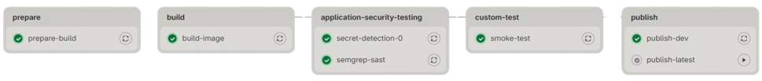
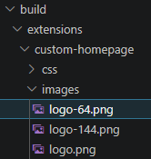

# guacamole-pam-pedro

PAM (Privileged Access Management) solution using Apache Guacamole as the remote desktop gateway, with automated build and deployment powered by GitLab CI/CD, Podman, and Ansible

This repository is a local deployment version intended for demonstration purposes.




## Requirements

- AlmaLinux 9 (other distros should work)
- Podman
- Ansible
- Firefox (recommended for certificate import)

## Quick Start

Clone the repository and navigate to the Ansible folder:

```sh
git clone https://github.com/ppvnf/pam-pedro-master.git
cd pam-pedro-master/ansible
```

Deploy the Guacamole image:

```sh
ansible-playbook deploy_local.yml
```

It will print instructions and credentials at the end. 



Import the mTLS certificate (saved in the current directory) into Firefox



Then log in as guacadmin at https://localhost/guacamole to set up TOTP


Once TOTP is configured, run the provisioning playbook:

```sh
ansible-playbook provision.yml
```

Provide the TOTP code, the certificate password and the guacadmin password before continuing.



Refresh the page and you should be able to see and connect to the demo containers using the guacadmin account.



Session recordings are enabled by default and available at:
https://localhost/guacamole/#/settings/postgresql/history





## SAML / Microsoft Entra SSO

SAML is disabled by default. To enable it:

1. Create an enterprise application in Microsoft Entra and configure it as described in section 5.4.2.3. SAML extension.
2. Enable SAML in `ansible/roles/deploy/defaults/main.yml`.



## Notes

- The GitLab CI/CD pipeline is not functional on GitHub.



- The company icons in `build/extensions/custom-homepage/images` have been replaced for this public release.



<a href="https://www.flaticon.com/free-icons/spiderman" title="Spiderman icons">Spiderman icons created by egorpolyakov - Flaticon</a>